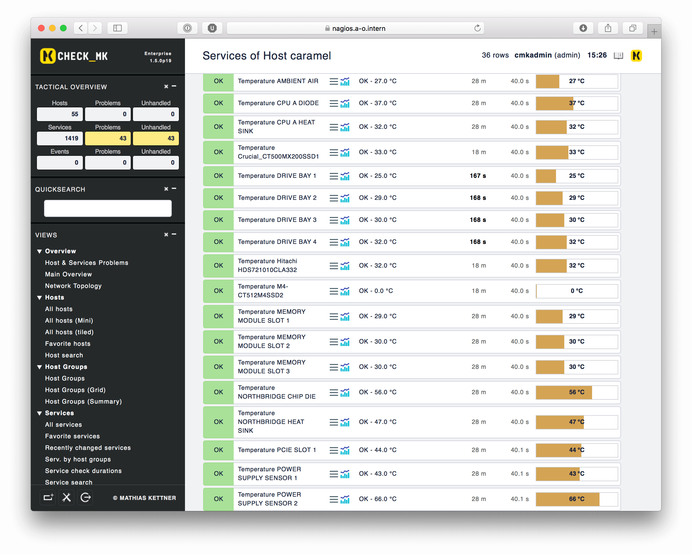
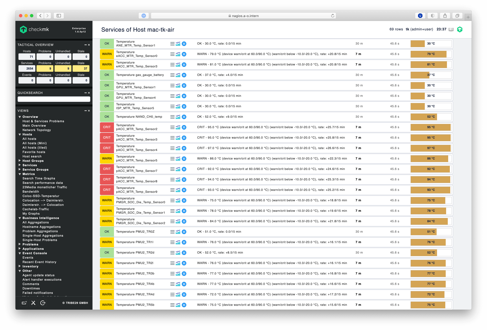
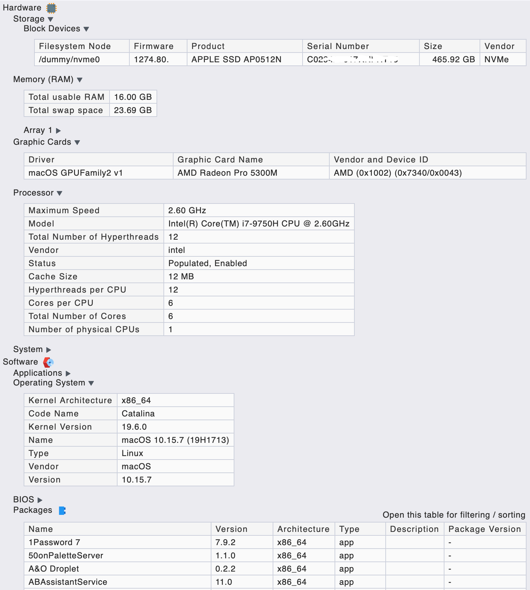
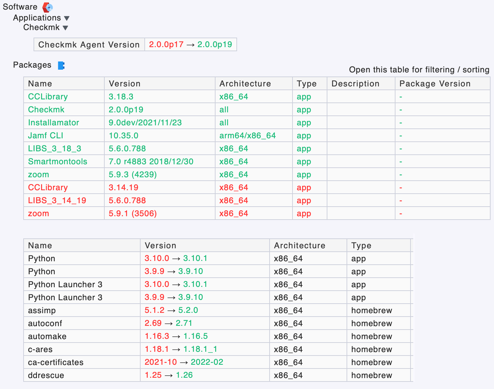

# Some Check_MK tweaks

## macOS support

A slightly tweaked macosx agent compared to the official one. As of 2.0.0p19 this agent has the following improvements:

  * [reports macOS version (e.g. `10.16 (20A4299v)`)](https://github.com/ThomasKaiser/Check_MK/commit/87e7aa5c79e80441f4d6243408f9442ceb20cf51)
  * [reports correct size of APFS volumes](https://github.com/ThomasKaiser/Check_MK/commit/bed6a9f7d2fe73501aa0e242405f4c1d49b5fc8a#commitcomment-40294001)
  * filters out temporarely appearing filesystems
  * reports network statistics [somewhat correctly](https://github.com/ThomasKaiser/Check_MK/commit/8b080c8bf01277a5710d2022982d1942d49779b8#comments)
  * runs ntp check only on macOS 10.12 and below since broken with newer macOS releases
  * runs timemachine check only on macOS 10.13 and below since broken with newer macOS releases
  * on recent Intel Macs reports thermals and fan speeds by using macOS' `powermetrics` tool
  * on older Intel Macs reports thermal sensors if [HardwareMonitor](https://www.bresink.com/osx/HardwareMonitor.html) is available or [iStatistica](https://www.imagetasks.com/istatistica/)
  * on Apple Silicon Macs reports thermal sensors and fan speeds if [iStatistica](https://www.imagetasks.com/istatistica/) is available
  * reports SMART health data and disk temperatures if `smartctl` is available (`brew install smartmontools`)
  * reports battery info and status
  * reports outstanding security updates
  * reports a warning if security updates require a reboot
  * supports HW/SW inventory (Mac/cpu/OS/devices info, serial numbers, installed apps, homebrew packages)
  * bundled with a LaunchDaemon that needs to be loaded as below (if you want more fine grained control who can access the agent's output see [here](https://github.com/ThomasKaiser/Check_MK/issues/1) for example):

    `launchctl load -w /Library/LaunchDaemons/de.mathias-kettner.check_mk.plist`

It looks like this with an old MacPro having plenty of hardware sensors, running with available `HardwareMonitor.app` and macOS prior to 10.15:

It looks like this with a new M1 MacBook Air having plenty of hardware sensors, running with `iStatistica.app` and macOS 11:

The fully searchable HW/SW inventory looks like this on a MacBook Pro:

Inventory history can be used to track software changes (Apps and homebrew packages):

## Agent plugins

  * [23M (colocation) downtime/maintainance](https://github.com/ThomasKaiser/Check_MK/blob/master/agents/plugins/23media-status)
  * [Active users of Helios EtherShare/PCShare, Samba, Netatalk, macOS server, Filemaker](https://github.com/ThomasKaiser/Check_MK/blob/master/agents/plugins/logins)
  * [Borgbackup](https://github.com/ThomasKaiser/Check_MK/blob/master/mrpe/check-borgbackup.sh)
  * [Canonical Livepatch](https://github.com/ThomasKaiser/Check_MK/blob/master/mrpe/check-canonical-livepatch.sh)
  * [City temperatures via openweathermap.org](https://github.com/ThomasKaiser/Check_MK/blob/master/agents/plugins/city-temperatures)
  * [Expiring Helios WebShare user accounts](https://github.com/ThomasKaiser/Check_MK/blob/master/agents/plugins/webshareaccounts)
  * [Expiring Julia Mailoffice certificates](https://github.com/ThomasKaiser/Check_MK/blob/master/mrpe/check-julia-certificates.sh)
  * [Expurgate spam/virus protection](https://github.com/ThomasKaiser/Check_MK/blob/master/agents/plugins/expurgate-status)
  * [Filemaker server on macOS or Linux](https://github.com/ThomasKaiser/Check_MK/blob/master/agents/plugins/filemaker-stats)
  * [Invalid logins for Kerio Connect](https://github.com/ThomasKaiser/Check_MK/blob/master/agents/plugins/monitor-invalid-kerio-logins.sh)
  * [Consumption and fan speeds via IPMI for some server types](https://github.com/ThomasKaiser/Check_MK/blob/master/agents/plugins/ipmi-consumption-and-fans.sh)
  * [Kerio Connect](https://github.com/ThomasKaiser/Check_MK/blob/master/agents/plugins/monitor-kerio)
  * [Netio switchable powermeters](https://github.com/ThomasKaiser/Check_MK/blob/master/agents/plugins/netio)
  * [NFON services downtime/maintainance](https://github.com/ThomasKaiser/Check_MK/blob/master/agents/plugins/nfon-status)
  * [Outstanding macOS updates with JAMF Pro](https://github.com/ThomasKaiser/Check_MK/blob/master/agents/plugins/monitor-jss-and-macos-updates)
  * [Reboot needed on Linux?](https://github.com/ThomasKaiser/Check_MK/blob/master/mrpe/check-for-reboot.sh)
  * [SHT4x thermal/humidity sensors accessible via I2C](https://github.com/ThomasKaiser/Check_MK/blob/master/agents/plugins/sht4x)
  * [SMART for ODROID HC2 and other JMS578 devices](https://github.com/ThomasKaiser/Check_MK/blob/master/agents/plugins/smart-odroid-hc2)
  * [TimeMachine client based on Netatalk](https://github.com/ThomasKaiser/Check_MK/blob/master/agents/timemachine_agent.linux)
  * [Znapzend / ZFS snapshot age](https://github.com/ThomasKaiser/Check_MK/blob/master/mrpe/check-znapzend-age.sh)
  * [Zswap](https://raw.githubusercontent.com/ThomasKaiser/Check_MK/master/agents/plugins/zswap)
